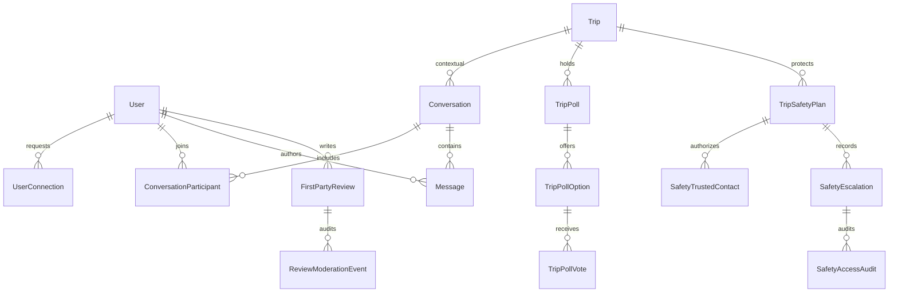

# Global Travel Social & Safety — API Contract, ERD and Authorization Tests V1
Date: 2026-10-08. DESIGN CONTRACT ONLY; not deployed or tested.
Based on main Prisma schema and existing TripAuthorizationService.

## Existing constraints
Trip.ownerId is virtual OWNER; TripMember unique(tripId,userId) with EDITOR/VIEWER; TripInvitation is not membership. TripAuthorizationService re-reads DB on each request. TripLocationSharing is explicit finite self-consent; TripMemberLocation stores only freshest coordinate with TTL. Comment supports EntityKind targets, parent/replies and moderation; CommunityVerificationState refers to content provenance, NOT a completed purchase. ProviderBookingReference is provider-reported booking metadata, not automatically a verified completed experience.

## ERD — proposed additive tables

Proposed fields and unique indexes:
- UserConnection(id,requesterId,recipientId,status,createdAt,updatedAt); canonical pair uniqueness, no self request; BLOCKED supersedes friendship and DMs.
- Conversation(id,type DIRECT|TRIP_GROUP|PROVIDER,tripId?,providerId?,createdAt); unique trip-group conversation per trip when active; no implicit trip membership.
- ConversationParticipant(conversationId,userId,role,joinedAt,leftAt,lastReadAt), unique(conversationId,userId); participant is necessary but NOT sufficient for trip conversation: live TripAuthorizationService check.
- Message(id,conversationId,senderId,body,createdAt,editedAt,deletedAt,clientMessageKey); unique(senderId,clientMessageKey); attachments require media ACL, moderation and virus scan.
- TripPoll(id,tripId,createdBy,question,closesAt,status), TripPollOption(id,pollId,label), TripPollVote(id,optionId,userId), unique per poll/user enforced transactionally.
- FirstPartyReview(id,authorId,targetType,targetId,rating,body,eligibilityEvidenceId?,status,createdAt,updatedAt); unique eligible booking/subject when eligibility verified; evidence from approved provider confirmation AND completion, never redirect/click alone.
- ExternalRatingReference(provider,externalPlaceId,targetType,targetId,summary,observedAt,attributionUrl,rightsPolicyId); do not copy Google review text or merge rating averages.
- TripSafetyPlan(id,tripId,userId,state,deadlineAt,graceUntil,consentVersion,revokedAt); unique active plan per trip/user; no auto-location opt-in.
- SafetyTrustedContact(id,planId,contactChannel,verifiedAt,acceptedAt,scope,revokedAt); sensitive channel encrypted, no public exposure.
- SafetyEscalation(id,planId,stage,idempotencyKey,queuedAt,sentAt,cancelledAt); unique idempotency key; event log; no public missing-person broadcast.
- SafetyAccessAudit(id,planId,actorId,scope,accessedAt,reason); append-only.

## API contracts (proposed /v1, require auth unless explicitly public)
### Friendship
POST /connections/requests {targetUserId} -> 201 {id,status:PENDING}; no self request; duplicate ->409; blocked ->403 generic.
POST /connections/requests/:id/accept ->200; only recipient.
POST /users/:id/block ->204; immediately revokes DM eligibility and discoverability.
GET /connections ->200 paginated, only caller's edges.

### Messaging
POST /conversations {type,tripId?,providerId?,participantUserId?} ->201 {id}; DIRECT requires consent/privacy rules; TRIP_GROUP creator must VIEW_TRIP; PROVIDER inquiry respects provider access.
GET /conversations ->200 caller-only paginated.
GET /conversations/:id/messages?cursor= ->200 paginated; live membership check every request.
POST /conversations/:id/messages {body,clientMessageKey} ->201 {id,createdAt}; authenticated active participant, not blocked, live trip membership for TRIP_GROUP, rate limits.
DELETE /conversations/:id/messages/:messageId ->204 sender/moderator; tombstone, preserve audit where necessary.
Socket delivery is optional transport; server REST authz remains source of truth. No implicit sharing of coordinates or contact data.

### Trip polls
POST /trips/:id/polls {question,options,closesAt} ->201; TripCapability.EDIT_TRIP.
GET /trips/:id/polls ->200; VIEW_TRIP.
POST /trips/:id/polls/:pollId/votes {optionId} ->200; VIEW_TRIP; reject closed poll, unique vote per user.
Removed member loses access on next request.

### Reviews
GET /reviews?targetType=&targetId=&source=ANCIQUEST ->200 with count and source attribution; only visible.
POST /reviews {targetType,targetId,rating,body,bookingEvidenceId?} ->201; server validates 1..5, target existence, eligibility and ownership.
POST /reviews/:id/replies {body} ->201; only verified provider owning target; one official response policy.
GET /external-ratings?targetType=&targetId= ->200 if licensed and attribution-compliant, else 204/no data. Never imply a Google score without API evidence.
Comments continue through existing /comments APIs; extend EntityKind only if target coverage requires it.

### Safety
POST /trips/:id/safety-plans {deadlineAt,graceMinutes,consentVersion} ->201; only self, accepted trip member/owner, explicit opt-in, no implicit GPS.
POST /safety-plans/:id/contacts {channel,scope} ->201 pending verification; verify contact acceptance through short-lived signed token.
POST /safety-plans/:id/check-in {status:SAFE|NEED_HELP,clientEventKey} ->200 idempotent.
POST /safety-plans/:id/cancel ->204; immediately invalidates pending escalation and access tokens.
POST /safety-plans/:id/assistance-requests ->202; only plan owner or verified accepted contact under authorized scope; audit every access.
GET /safety-plans/:id/location ->200 only when location sharing independently active, fresh and scope explicitly authorized; otherwise 403/410. Never publicly searchable.
Delayed queue: due -> remind -> grace -> verified contact alert; message is 'check-in not confirmed', not 'missing'. Retries idempotent, cancellation wins races, expiry checked at delivery time.

## Authorization test matrix (mandatory, not yet executed)
| Actor / state | Trip messages | Poll create | Poll vote | Safety location |
| --- | --- | --- | --- | --- |
| OWNER active | allow | allow | allow | only with separate self-consent and authorized scope |
| EDITOR active | allow | allow | allow | same |
| VIEWER active | allow | deny | allow | same |
| Invited but not accepted | deny | deny | deny | deny |
| Removed member | deny immediately | deny | deny | deny |
| Stranger | deny | deny | deny | deny |
| Blocked user | deny direct messaging | trip ACL still checked; moderation policy required | trip ACL checked | deny absent scope |
| Contact verified but not authorized for location | not a trip participant | deny | deny | deny |
| Contact authorized, sharing stopped/expired | no trip membership by default | deny | deny | deny |

## Test files planned
apps/api/src/modules/social/social-authorization.service.spec.ts
apps/api/src/modules/social/conversations.service.spec.ts
apps/api/src/modules/trips/trip-polls.service.spec.ts
apps/api/src/modules/reviews/reviews.service.spec.ts
apps/api/src/modules/safety/safety-escalation.service.spec.ts
apps/api/test/global-travel-privacy.e2e-spec.ts
Coverage: horizontal IDOR, removed-member reconnect, block race, replay/idempotency, stale GPS, revoked consent, timezone/DST, queue cancellation race, unverified contact, forged review eligibility, moderation.

## Vertical slice 1 proposal
Group trip discussion on existing Trip and TripAuthorizationService:
1. Add Conversation, ConversationParticipant and Message with migration; use only TRIP_GROUP initially.
2. POST/GET group messages authenticated, paginated, throttled and idempotent; owner/EDITOR/VIEWER may message, removed/invited/stranger denied.
3. Web trip detail discussion UI, empty/loading/error states; mobile parity later.
4. Unit+integration+E2E security tests; screenshot 1536/390 against approved visual master.
No production merge until exact-head tests and human visual QA. Subsequent slices: direct/provider messaging, friendship, polls, reviews, safety.

## Preconditions
Review actual enums, migrations and full provider booking completion evidence; secure threat-model review; independent Desktop/Mobile masters still pending. Do not apply schema before these checks.
